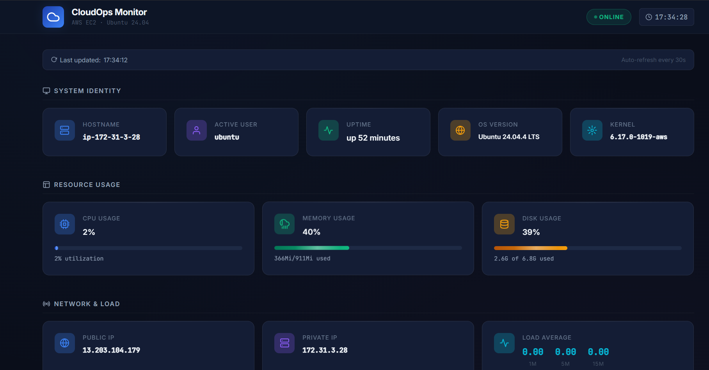
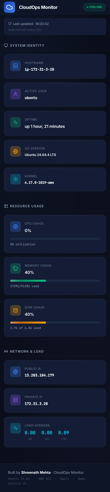

# ☁️ CloudOps Monitor

> A lightweight Linux and AWS EC2 server monitoring and automation dashboard built with Bash, Nginx, Cron, and vanilla JavaScript. Built as a hands-on DevOps portfolio project demonstrating production-style Linux administration, system health auditing, atomic metric collection, and local backup/restore automation.

[](https://ubuntu.com/)
[](https://aws.amazon.com/ec2/)
[](https://nginx.org/)
[](https://www.gnu.org/software/bash/)
[](LICENSE)

---

## 📸 Screenshots


| Live Web Dashboard | Mobile Responsive View |
|---|---|
|  <br>  |  <br>  |

---

## 🏗️ Architecture

The v1 system operates entirely within the AWS EC2 instance using native Linux utilities and standard Nginx web serving:

```
┌─────────────────────────────────────────────────────────────┐
│                   AWS EC2 Instance (Ubuntu 24.04)           │
│                                                             │
│   Linux Cron Daemon                                         │
│   ├── monitor.sh (every 1 min)   ──▶ dashboard/status.json  │
│   ├── healthcheck.sh (every 30m) ──▶ logs/healthcheck.log   │
│   ├── backup.sh (daily at 00:00) ──▶ backups/*.tar.gz       │
│   └── cleanup.sh (daily at 02:00)──▶ safe file retention    │
│                                                             │
│   Nginx Web Server (Port 80)                                │
│   └── Document Root: /dashboard                             │
│       ├── index.html                                        │
│       ├── style.css                                         │
│       ├── script.js (auto-refresh every 30s)                │
│       └── status.json (atomic read target)                  │
└──────────────────────────────┬──────────────────────────────┘
                               │ HTTP (Port 80)
                               ▼
                     ┌──────────────────┐
                     │  Web Browser     │
                     │  Live Dashboard  │
                     └──────────────────┘
```

### Automation Workflows
* **Metrics Pipeline**: `Linux Cron` ──▶ `scripts/monitor.sh` ──▶ `dashboard/status.json` ──▶ `Nginx` ──▶ `Browser (fetch every 30s)`
* **Health Pipeline**: `Linux Cron` ──▶ `scripts/healthcheck.sh` ──▶ `logs/healthcheck.log` & `logs/health_report.txt`
* **Backup Pipeline**: `Linux Cron` ──▶ `scripts/backup.sh` ──▶ `backups/cloudops-monitor_TIMESTAMP.tar.gz`
* **Cleanup Pipeline**: `Linux Cron` ──▶ `scripts/cleanup.sh` ──▶ removes expired backups (>7 days) & old logs (>30 days)

---

## ✨ Features

### Dashboard (Frontend)
- 📊 **15 Real-Time Metrics** — Hostname, active user, uptime, OS, kernel, CPU %, memory %, disk %, public IP, private IP, and 1m/5m/15m load averages.
- ⚡ **Animated Resource Meters** — CPU, memory, and disk progress bars with warning color thresholds at 85%+.
- 🔄 **30-Second Auto-Refresh** — Background polling with cache-busting to always display the latest status.
- 🟢 **Live Status Indicator** — Pulsing online/offline badge and automatic offline warning banner with retry countdown.
- 🔔 **Toast Alerts** — Non-intrusive notifications on initial connection and connection restoration.
- 🕐 **Live Header Clock** — Real-time 24-hour clock.
- 📱 **Responsive & Accessible** — CSS Grid layout adapting from 5 columns on desktop to 1 column on mobile; full ARIA semantics.

### Automation Engine (Bash & Cron)
- ⏱️ **1-Minute Metrics Collection** — `monitor.sh` samples CPU across a 1-second interval via `/proc/stat`, evaluates memory via `free`, and disk via POSIX `df -Ph`.
- ⚛️ **Atomic Writes** — Metrics are assembled into a `.tmp` file and atomically moved into `status.json` to prevent partial reads by Nginx or browsers.
- 🔒 **IMDSv2 Integration** — Secure AWS Instance Metadata Service v2 session tokens for public/private IP resolution, with fallback public APIs.
- 🩺 **Non-Destructive Health Auditing** — `healthcheck.sh` audits Nginx service state, validates Nginx config syntax (`sudo -n nginx -t`), monitors disk/RAM/CPU thresholds, and checks `status.json` freshness.
- 📦 **Automated Local Backups** — `backup.sh` produces timestamped `.tar.gz` archives with verified path exclusions (`backups/`, `logs/`, `.git/`, `*.tmp`).
- 🛡️ **Safe Restore with Rollback** — `restore.sh` tests archive integrity before extraction and automatically snapshots a rollback archive before touching live files.
- 🧹 **Retention & Disk Protection** — `cleanup.sh` enforces retention rules (preserves minimum 2 backups, deletes archives older than 7 days and logs older than 30 days) while protecting `status.json`.
- 🔁 **Idempotent Cron Management** — `cron_setup.sh` safely adds or updates the CloudOps managed cron block without disturbing existing third-party cron jobs.

---

## 🛠️ Tech Stack

| Layer | Technology | Purpose |
|---|---|---|
| **Platform** | AWS EC2 (t3.micro) | Cloud hosting environment |
| **Operating System** | Ubuntu Server 24.04 LTS | Linux OS and core system utilities |
| **Web Server** | Nginx 1.x | Serves static dashboard assets and status.json over HTTP |
| **Backend & Automation** | Bash 5.x | Metric collection, health auditing, backup, restore, and cleanup scripts |
| **Scheduling** | Linux Cron | Automated execution of monitoring and maintenance scripts |
| **Frontend** | HTML5, CSS3, Vanilla JavaScript | Responsive dark-theme dashboard UI with auto-refresh |
| **Data Exchange** | JSON (`status.json`) | Lightweight bridge between Bash metric collector and web UI |
| **Version Control** | Git / GitHub | Code management and deployment workflow |

---

## 📁 Folder Structure

```
CloudOps-Monitor/
├── dashboard/              # Frontend web application (served by Nginx)
│   ├── index.html          # Semantic HTML5 dashboard layout
│   ├── style.css           # Dark theme design tokens, layout grid, and animations
│   ├── script.js           # Client-side data fetching (30s interval), UI rendering, and timers
│   └── status.json         # Real-time metrics generated every minute by monitor.sh
│
├── scripts/                # Bash automation scripts
│   ├── monitor.sh          # Collects system metrics → status.json (Cron: every 1 minute)
│   ├── healthcheck.sh      # Audits Nginx, resources, and freshness (Cron: every 30 minutes)
│   ├── backup.sh           # Creates local .tar.gz archive in backups/ (Cron: daily at 00:00)
│   ├── cleanup.sh          # Prunes expired backups and logs (Cron: daily at 02:00)
│   ├── restore.sh          # Restores from backup with automatic rollback snapshot
│   ├── cron_setup.sh       # Installs/updates the managed cron block
│   ├── install.sh          # Initial EC2 setup: installs packages and configures Nginx virtual host
│   └── upload.sh           # Standalone S3 upload utility (optional manual script; not active in v1 cron)
│
├── backups/                # Local project archives and rollback snapshots
├── logs/                   # Script execution logs (monitor, healthcheck, backup, cleanup)
├── reports/                # Health check summary reports
├── screenshots/            # Dashboard images for documentation
├── .gitignore              # Ignores runtime logs, backups, temporary files, and credentials
├── LICENSE                 # MIT License
└── README.md               # Project documentation
```

---

## 🚀 Installation & Deployment

### Prerequisites
- An active AWS EC2 instance running **Ubuntu Server 24.04 LTS**.
- EC2 Security Group with inbound rules:
  - **SSH (Port 22)**: Restricted to your IP address.
  - **HTTP (Port 80)**: Open for web dashboard access.

### Step 1 — Connect to EC2
```bash
ssh -i /path/to/your-key.pem ubuntu@YOUR_EC2_PUBLIC_IP
```

### Step 2 — Clone Repository
```bash
git clone https://github.com/Shreenathmehta32/CloudOps-Monitor.git
cd CloudOps-Monitor
```

### Step 3 — Run Project Setup
Execute the installer with `sudo` to configure directories, install prerequisites (Nginx, curl, git), configure the Nginx virtual host, set file permissions, and generate initial metrics:
```bash
sudo bash scripts/install.sh
```

### Step 4 — Configure Cron Automation
Install the managed cron schedules under your current user account:
```bash
bash scripts/cron_setup.sh
```

Verify that the managed block was successfully installed:
```bash
crontab -l
```

### Step 5 — Open Dashboard
Navigate to your instance's public IP in any web browser:
```
http://YOUR_EC2_PUBLIC_IP
```

---

## 📖 Usage & Operations

### Collect System Metrics Manually
```bash
bash scripts/monitor.sh
cat dashboard/status.json
```

### Run System Health Audit
```bash
bash scripts/healthcheck.sh
# Exit codes: 0 = Healthy, 1 = Warning / Degraded, 2 = Critical
```

### Create a Local Backup
```bash
bash scripts/backup.sh
```

### Restore from Backup
```bash
# Interactive selection of latest backup (creates rollback snapshot first):
bash scripts/restore.sh

# Or restore a specific backup archive:
bash scripts/restore.sh cloudops-monitor_20261004_120000.tar.gz

# Automated / non-interactive restore:
bash scripts/restore.sh --yes
```

### Run Maintenance Cleanup
```bash
# Preview what would be deleted without removing files:
bash scripts/cleanup.sh --dry-run

# Execute cleanup according to retention rules:
bash scripts/cleanup.sh
```

---

## 📊 status.json Schema

The dashboard consumes metrics from `dashboard/status.json`, which is regenerated every minute by `monitor.sh` via cron:

```json
{
    "hostname":       "ip-172-31-3-28",
    "user":           "ubuntu",
    "date":           "Sun Oct  4 17:00:00 UTC 2026",
    "uptime":         "up 1 hour, 2 minutes",
    "memory":         "411Mi/911Mi",
    "memory_percent": "45",
    "disk":           "34%",
    "disk_used":      "6.8G",
    "disk_total":     "20G",
    "cpu_percent":    "12",
    "load_avg":       "0.15 0.10 0.08",
    "os":             "Ubuntu 24.04.2 LTS",
    "kernel":         "6.8.0-1024-aws",
    "public_ip":      "13.203.104.179",
    "private_ip":     "172.31.3.28"
}
```

---

## 🧪 Testing & Verification

The deployed v1 system components have been validated on the EC2 Ubuntu server:

* **Health Check Audit (`healthcheck.sh`)**: Verified system reports `Overall: HEALTHY — all checks passed` with active Nginx service, valid configuration syntax (`sudo -n nginx -t`), and healthy resource thresholds.
* **Metric Collector (`monitor.sh`)**: Verified atomic updates to `status.json` and correct retrieval of CPU, RAM, disk, load averages, and IMDSv2 IPs.
* **Cron Execution**: Verified cron schedules trigger automatically, with `monitor.sh` executing every minute to update `status.json` and keep data fresh.
* **Backup Creation & Exclusions (`backup.sh`)**: Verified timestamped `.tar.gz` creation and verified that `backups/`, `logs/`, `.git/`, and `*.tmp` files are strictly excluded from archives.
* **Restore & Rollback Protection (`restore.sh`)**: Tested archive verification, file restoration, and confirmed automatic rollback snapshot creation in `backups/rollback/`.
* **Cleanup Safety (`cleanup.sh`)**: Verified retention boundaries, confirmed `--dry-run` accuracy, and verified that `dashboard/status.json` and recent backups are never deleted.
* **Cron Idempotency (`cron_setup.sh`)**: Tested repeated execution; confirmed only one managed block exists and third-party crontab entries remain undisturbed.

---

## 🔐 Security Considerations

- **Inbound Access Control** — Port 80 is required for HTTP dashboard access; restrict SSH (port 22) in your AWS Security Group strictly to your personal IP address.
- **Exposed Metadata** — Because `status.json` exposes host IP and system resource statistics, production deployments should restrict Nginx access by IP or place the instance behind a VPN/private subnet.
- **Git Hygiene** — `.gitignore` prevents logs, local backups, temporary files, editor configs, and private SSH keys (`*.pem`, `*.key`, `.env`) from being tracked in version control.
- **IMDSv2** — Token-oriented IMDSv2 is prioritized over legacy IMDSv1 to protect against SSRF-based metadata leakage.
- **Least Privilege** — Regular monitoring scripts execute under the unprivileged `ubuntu` user; only Nginx syntax verification requests non-interactive `sudo -n nginx -t`.

---

## 🔮 Future Improvements

Features planned for future iterations beyond the current v1 architecture:

| Feature | Description | Priority |
|---|---|---|
| **AWS S3 Backup Sync** | Automated off-site backup synchronization via `upload.sh` using IAM EC2 roles | Medium |
| **HTTPS Support** | SSL/TLS certificate automation using Let's Encrypt / Certbot | High |
| **Alerting Notifications** | Amazon SNS or webhook alerts when health checks detect critical thresholds | Medium |
| **Historical Metrics** | Time-series metrics storage and visualization via Chart.js | Medium |
| **Multi-Instance Dashboard** | Centralized view aggregating metrics across multiple EC2 nodes | Low |
| **Infrastructure as Code** | Terraform module to provision the EC2 instance, security groups, and networking | Low |

---


---

## 👤 Author

**Shreenath Mehta**
* Cloud & DevOps Portfolio Project
* Platform: AWS EC2 · Ubuntu 24.04 LTS · Nginx · Bash · Linux Cron · Vanilla JS

---

## 📄 License

This project is licensed under the [MIT License](LICENSE).
